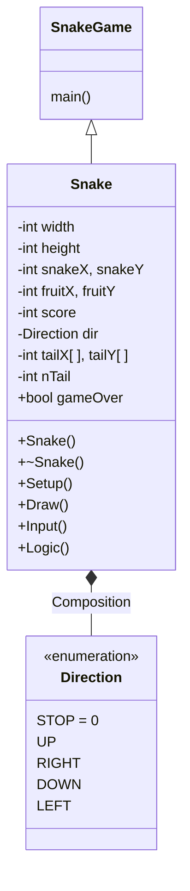

# Snake Game

This is a simple snake game built using C++. Snake can move up, right, down, left. If snakes eats the fruit '@' then its length increases and score gets increased by 5 and if snake touches the wall of the game window or snake hit itself then game will be over.


<br/>
## Screenshots
<div style="margin-left:50px">


</div>

<br/>
## How to play
You can press these keys to change the direction of the snake or to exit the game.
<div style="margin-left:50px">

| Key  | Direction  |
| -----| -----------|
| w    | UP         |
| s    | DOWN       |
| a    | LEFT       |
| d    | RIGHT      |
| x    | QUIT       |
</div>

<br/>
## Libraries we'll need

- [**conio.h**](https://en.wikipedia.org/wiki/Conio.h) : For console input and output. For windows systems you can download the file. For linux systems that file is in the repository.
- **uninst.h** : usleep() function in linux systems, to slow down the game. usleep() function suspends execution for microsecond intervals.
- **Windows.h** : Sleep() function in windows systems, to slow down the game. Sleep() function suspends execution for second intervals.

  **Other libraries are included in cpp files**
 
<br/>
## To run the game

First we have to compile the game :

```bash
  g++ *.cpp -o output
```
<br/>
To execute the compiled file run :

```bash
  ./output
```

<br/>
## UML Diagram


<div style="margin-left:30%;">


</div>


<br/>
## Support

<a href="https://www.buymeacoffee.com/jordian" target="_blank" style="margin-left:50px;"></a>
